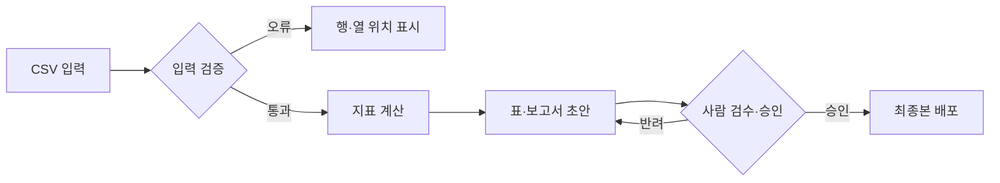

# 월간 리포트 보조 서비스 PRD

## 목적과 사용자

운영 담당이 검산 가능한 월간 보고 초안을 만들고, 팀장이 근거가 있는 조사·승인 요청을 판단할 수 있도록 합니다. 결과물은 요약표, 1페이지 보고서, 검수표입니다.

## 범위

입력은 월간 판매·반품 CSV와 목표 CSV입니다. 필수 열, 기간, 중복, 결측을 검사하고 합계·비율·목표 차이를 계산합니다. 검수된 수치를 요약표와 보고서에 연결합니다.

자동 결재, 외부 전송, 사내 시스템 연동, 원인·제품 안전·법규 적합성 자동 판단은 첫 버전에서 제외합니다.

## 사용자 흐름

## 상세 요구사항

| ID | 기능 | 처리·예외 | 인수 조건 |
| --- | --- | --- | --- |
| R01 | 입력 유효성 검사 | 누락 열은 생성 중단. 누락 값·중복은 해당 행·열 위치 표시 | 누락·중복 테스트 파일에서 오류 위치 재현 |
| R02 | 지표 계산 | 판매 0개인 비율은 계산 불가. 없는 목표는 미확인 | 7월 판매 2,630개·목표 2,720개·달성률 96.7% |
| R03 | 보고서 생성 | 없는 원인·담당·기한은 확인 필요 유지 | 결론·근거·결정 요청 존재. 작성 대화 혼입 0건 |
| R04 | 기록·파일 분리 | 원자료 읽기 전용. 덮어쓰기 전 사람 승인 | 원자료 불변, 작업 기록과 결과 본문 분리 |
| R05 | 최종 배포 | 미승인 상태의 외부 전송 차단 | 승인 전 발송 없음. 승인된 파일만 배포 |

## 지표 정의

판매 변화=(7월 판매−6월 판매)÷6월 판매. 목표 달성률=판매 합계÷목표 합계. 반품 비율=접수 건수 합계÷판매 개수 합계. 퍼센트 차이는 `%p`로 표시합니다. 실제 사업의 반품률 정의와 같은 지표라고 단정하지 않습니다.

## 권한과 기록

원자료와 지표 정의는 `inputs/`, `context/`에 둡니다. 계산표·초안·검수 질문·수정 이력은 `work/`에 보관합니다. 필요한 업무 결정·승인 기록은 `decisions/`에 둡니다. `outputs/`에는 승인 검토용 또는 승인 완료 상태를 명시한 결과 본문만 저장합니다.

## 검증 시나리오

1. 정상 입력: 기준 수치와 산식이 원자료에 일치.
2. 필수 열 누락: 생성 중단 및 열 이름 표시.
3. 값 누락·중복: 해당 위치 표시, 묵시적 보정 없음.
4. 판매 0개: 비율을 0%로 위장하지 않고 계산 불가 표시.
5. 담당·기한 미정: 확인 필요 유지.
6. 초안에 작성 대화 포함: 최종 본문에서 제거하되 작업 기록에 보관.
7. 승인 없는 배포: 차단.

## 남은 결정

사용자 권한, 승인자, 보존 기간, 배포 채널, 실제 입력 형식과 예외의 우선순위를 확정해야 합니다. 서비스 도입 전에 조직의 AI·정보보안 정책을 확인합니다.
