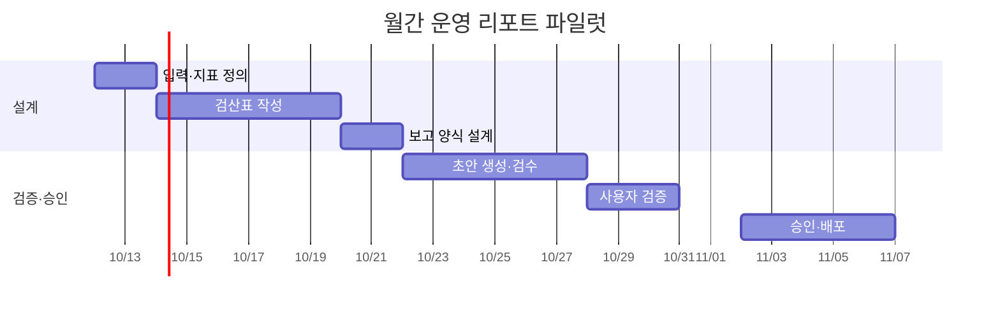

# 월간 운영 리포트 파일럿 WBS

목표: 원자료 검산부터 보고서 승인까지의 작업 흐름을 4주 안에 검증합니다. 아래 역할·날짜는 계획 예시입니다.

| ID | 작업 | 담당 역할 | 선행 | 시작 | 종료 | 완료 산출물 |
| --- | --- | --- | --- | --- | --- | --- |
| 1 | 입력·지표 정의 | 운영 담당 | — | 10/12 | 10/13 | 열 정의·범위 |
| 2 | 검산표 작성 | 분석 담당 | 1 | 10/14 | 10/19 | 수치·산식 |
| 3 | 보고 양식 설계 | 기획 담당 | 2 | 10/20 | 10/21 | 보고서 틀 |
| 4 | 초안 생성·검수 | 개발 담당 | 3 | 10/22 | 10/27 | 초안·오류표 |
| 5 | 사용자 검증 | 팀장·운영 | 4 | 10/28 | 10/30 | 인수 결과 |
| 6 | 승인·배포 | 책임자 | 5 | 11/02 | 11/06 | 최종본·운영안 |

엑셀로 수정할 때는 `wbs-gantt.csv`를 가져오세요. 작업·역할·날짜·선행 관계를 먼저 검토한 뒤 기간 막대를 그립니다. 각 선행 작업이 끝난 다음 후속 작업이 시작하도록 설계했습니다. 기간 막대는 주차 단위 요약이며 주 전체의 작업량을 뜻하지 않습니다.

완료 조건: 파일 생성, 수치 검산, 사용자 검토, 최종 승인. 선행 작업의 지연 시 영향받는 후속 작업과 승인일을 함께 다시 계산합니다.
